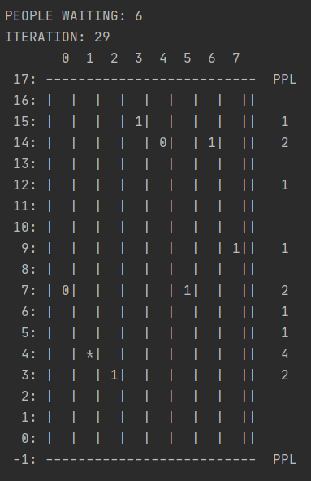

# Elevator system
**Implementation and simple simulation** of my elevator system

## How to open
 After downloading the repository, change the working directory to `src/main`. Then run the command to compile.
 ```bash
 javac pkrucz00/Main.java
```
Then run the simulation with
```bash
 java pkrucz00/Main [noElevators] [noStoreys] [noIterations] [reversedIntensity] [sleepTime] [mode]
``` 

where 
- `noElevators` - number of elevators in system
- `noStoreys` - number of floors in our building (excluding the ground floor)
- `noIterations` - number of iterations (steps) our elevator system will proceed in the simulation
- `reversedIntensity` - integer indicating expected length of a time interval (in steps) between spawns of a person in a building
- `sleepTime` - [integer] time between steps (in seconds)
- `mode` - one of 3 modes in the simulation. They include:
    - `uniform` - uniform distribution of people in equal time intervals
    - `bursts` - similar to `uniform` but 2-6 people spawn at once on one floor
    - `irregurarly` - similar to `uniform` but the time interval between two spawns is irregular
   
Example:
```
java pkrucz00/Main 8 16 3 1 1 uniform
```

will run simulation 
- with 8-elevators in the system,
- with 16 storeys building
- with 3 iterations
- with people spawning in every iteration
- with sleep time of 1
- with people spawning uniformly

You can always type `java pkrucz00/Main help` for similar explanation.

Alternatively run the code with the help of IDE.

## Explanation of the elevator system mechanism
Have you ever used an elevator and pondered "How does the elevator know what to do?".
Have you ever been left with the feelings of frustration after another elevator just past by you?
Moreover, you thought "I bet I could do a system like that on my own"?

You may have not, but I had. So I've made one myself in java.

How does it work?
- 

The system splits the "reasoning" of the elevator into:
- `ElevatorSystem` which controls a number of
- `Elevators`

Elevator
-

Let's look at the `Elevator` first.

Every elevator in the system acts like a finite state machine.<br>
It has 3 states: IDLE, UP, DOWN, and a list of jobs - floors it has to go to.<br>
From the elevator system it can receive a request to `addJob(int floorNumber, bool isGoingUp)` or make a `step()`<br>
`addJob` simply adds a job to the list,
 `step` tells the elevator to act accordingly to its current state, and the jobs it has.
 
 How can this elevator get its job done? First thought that comes to mind is to use a FIFO approach.
 Unfortunately this has some drawbacks.<br>
 Let's think about one elevator with a person going from 3rd to 7th floor. On the 4th floor person wants to go to the 6th floor.
 The order of jobs is `3 then 4 then 7 then 6`. This means the person from 4th will have to go one floor higher, and only then to the lower even though the elevator could have stopped earlier.
 
 My solution is to keep all the jobs in a sorted set (implemented as a TreeSet). This way we keep the jobs in order and can quickly check if we have reached one of our destinations.
 Person on 6th can now happily go out before the other person.
 
 So the first idea is to store the job data in sortedset and go to the closest job. That's still not enough. 
 
 Second idea of mine implemented here takes advantage of the fact that we have (usually) multiple elevators in our system.
 Consider a situation where jobs of the elevator is the set `{5, 8}` and it is currently at 4th floor.<br>
 While being at the 5th floor we received a signal to go to the `3`. Now we want our elevator to go up, because "the 8th floor" person waits longer.
 Therefore, we implement that **when there is a successor in jobs** (with regard to the current floor) **we will go up**. The opposite holds for going down.
 
 In other words we want our elevator to act with some kind of artificial inertia - as long as it's possible, keep your direction.
 If it receives a signal from the opposite direction it currently proceeds? Well, that was up to the `Elevator System` to decide, if this particular elevator should have taken this job at all.
 
 Elevator System
 -
 
 The elevator system has three main methods:
 ```java
public interface IElevatorSystem {
    Elevator pickup(int floorNumber, boolean isGoingUp);

    void step();  

    StatusQuadruple[] status();
}
```

Let's start with the easiest:

`step()` sends the `step()` signal to all the elevators

`status()` returns StatusQuadruple table consisting of quadruples in form
            `(elevatorID, currentFloor, destinationFloor, state)`, where
 - elevatorID is the ID of the given elevator
 - currentFloor is the floor the elevator is currently at
 - destinationFloor is the highest (if state is UP) or lowest (if state is DOWN) current pending job of a given elevator (null if state is IDLE)
 - state is the current state of the elevator
 
 `pickup(int floorNumber, boolean isGoingUp)` is where all the magic happens.<br>
 It receives a signal with current floor of a person and their preferable direction. (Action analogical to pushing a button to request an elevator in a building).<br>
 After that if considers:
 1. at first all the elevators that are
    - IDLE
    - in concurring state (UP if the request was for up, DOWN otherwise), AND the requested floor is in range between current and destination floor of the elevator.
<br>They are compared regarding the distance between the current elevator floor and the request floor. The minimal element is chosen.
2.  If this subset is empty, it sends the signal to the closest elevator regarding the distance between the destination floor, and the request floor.
The function returns the elevator to which the signal was sent. This way person waiting for the elevator can observe it and enter the elevator.

That's about it in regard to the main functionality of the system. It can be of course expanded.<br>
One of additional functionalities is opening the door with takes one step. It's not another state, it only helps indicate that the elevator can take people in.<br>
I haven't implemented the max person in elevator limit, because it's easier to see the mechanism in action if we are not bounded by this limit.

The simulation
-
Beside the provided unit tests, I've written some short class to show the progress in our elevator system.
  


This is a screenshot of one block in the simulation indicating one step.

Legend:
- inside cells - the elevators with number of people inside of them; the `*` indicates open door
- on the right, under the PPL ("people") sign - number of people on a given floor
- on the left - numbers of floors
- on the top - IDs of the elevators in the system

